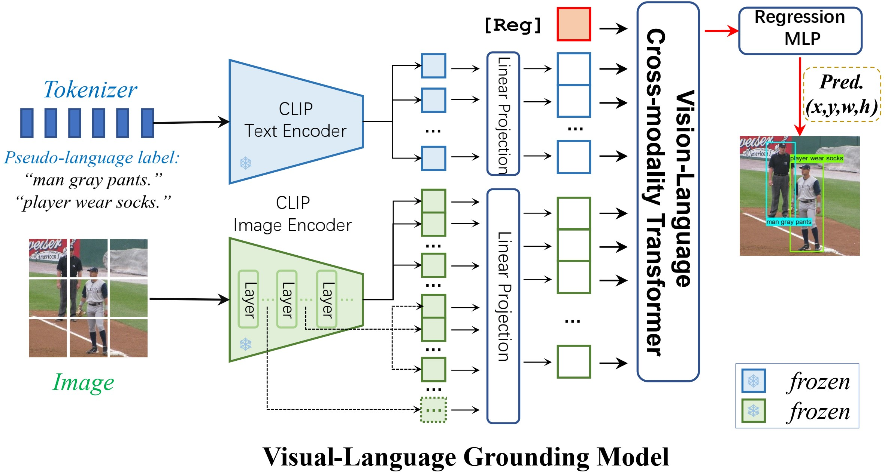
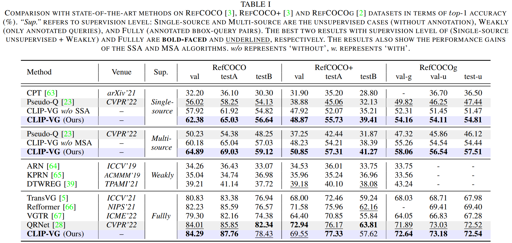
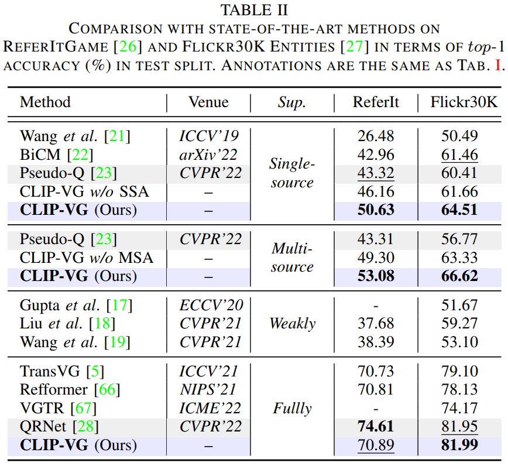
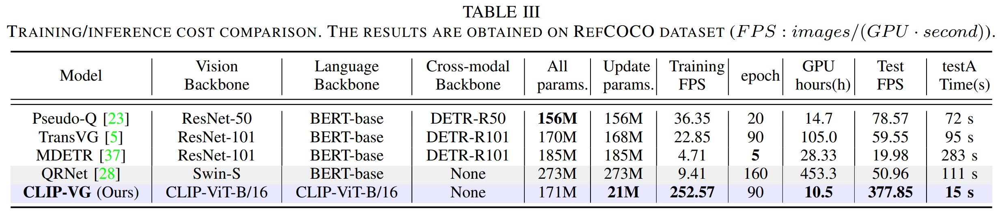
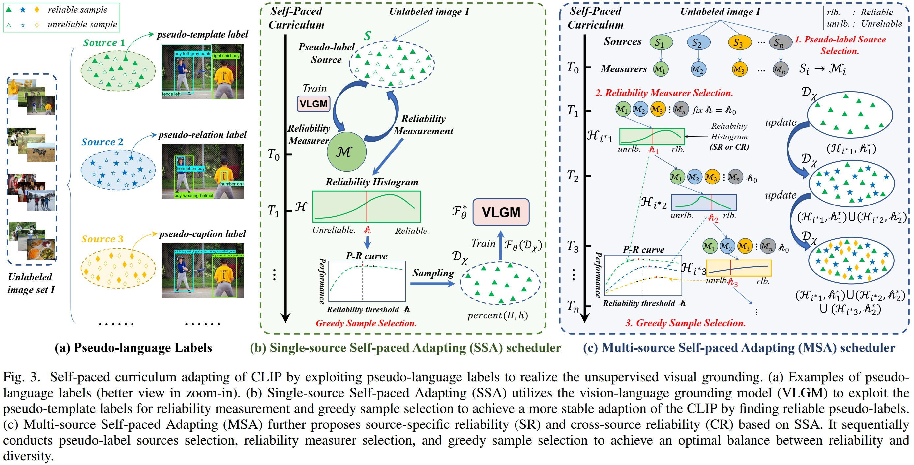
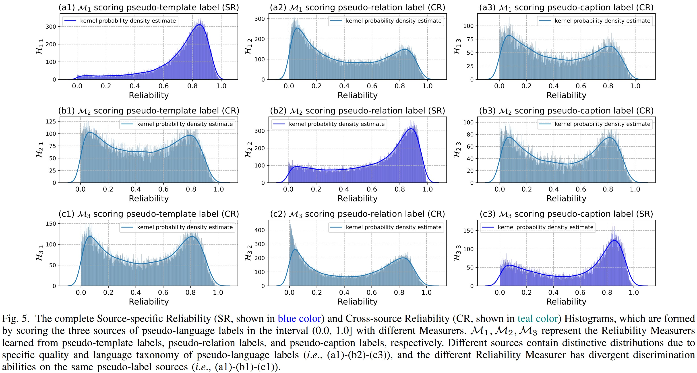
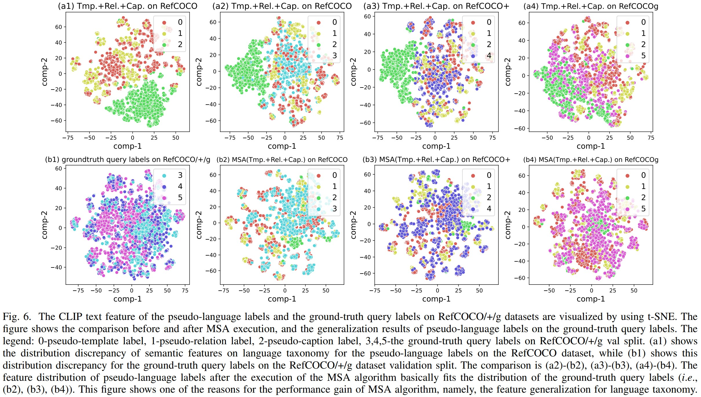
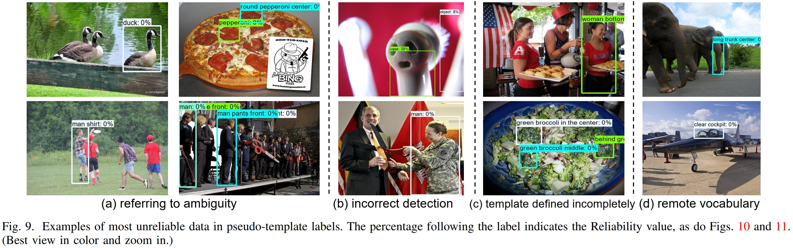
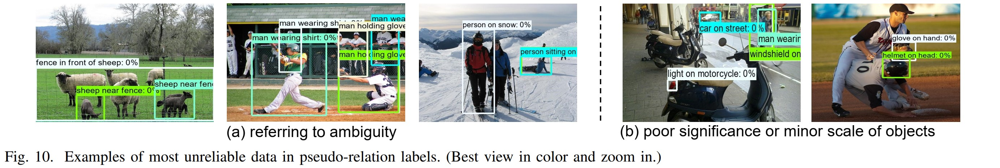
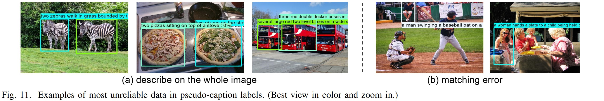

<p align="center"> <h1 align="center">CLIP-VG: Self-paced Curriculum Adapting of CLIP for Visual Grounding</h1>
  <p align="center">
    <b> IEEE Transaction on Multimedia, 2023 </b>
    <br />
    <a href="https://scholar.google.com.hk/citations?user=4rTE4ogAAAAJ&hl=zh-CN&oi=sra"><strong> Linhui Xiao </strong></a>
    ·
    <a href="https://yangxs.ac.cn/home"><strong>Xiaoshan Yang </strong></a>
    ·
    <a href="https://scholar.google.com.hk/citations?user=HBZ9plsAAAAJ&hl=zh-CN"><strong>Fang Peng </strong></a>
    ·
    <a href="https://scholar.google.com.hk/citations?user=uIUfGxYAAAAJ&hl=zh-CN"><strong>Ming Yan </strong></a>
    ·
    <a href="https://scholar.google.com.hk/citations?user=o_DllmIAAAAJ&hl=zh-CN"><strong>Yaowei Wang </strong></a>
    ·
    <a href="https://scholar.google.com.hk/citations?user=hI9NRDkAAAAJ&hl=zh-CN"><strong>Changsheng Xu</strong></a>
  </p>

  <p align="center">
    <a href='https://arxiv.org/pdf/2305.08685'>
      
    </a>
    <a href='https://ieeexplore.ieee.org/abstract/document/10269126'>
      
    </a>

<br />


<p align="center">  </p>

**<p align="center"> CLIP for Unsupervised and Fully Supervised Visual Grounding.  </p>**

This repository is the official Pytorch implementation for the paper [**CLIP-VG: Self-paced Curriculum Adapting of CLIP 
for Visual Grounding**](https://ieeexplore.ieee.org/abstract/document/10269126). 

If you have any questions, please feel free to open an issue or contact me with emails: <xiaolinhui16@mails.ucas.ac.cn>.

<h3 align="left">
Links: <a href="https://ieeexplore.ieee.org/abstract/document/10269126">IEEE Transaction on Multimedia (2023)</a>,   
<a href="https://arxiv.org/abs/2305.08685">ArXiv</a>,
[<a href="https://mp.weixin.qq.com/s/fwbamVr5P5Vcj5XheopQOg">中文解读</a>]
</h3>

**Please leave a <font color='orange'>STAR ⭐</font> if you like this project!**

## News
 
- :fire: **Update on 2024/12/28: We conducted a survey of Visual Grounding over the past decade, entitled "Towards Visual Grounding: A Survey" ([Paper](https://arxiv.org/pdf/2412.20206), [Project](https://github.com/linhuixiao/Awesome-Visual-Grounding)), Comments are welcome !!!**
- :fire: **Update on 2024/09/26: Our grounding work OneRef ([Paper](https://openreview.net/pdf?id=siPdcro6uD), [Code](https://github.com/linhuixiao/OneRef)) has acceptance by top conference NeurIPS 2024 in October 2024!**
- :fire: **Update on 2024/07/16: Our grounding work HiVG ([Paper](https://openreview.net/pdf?id=NMMyGy1kKZ), [Code](https://github.com/linhuixiao/HiVG)) has acceptance by top conference ACM MM 2024 in July 2024!**
- **Update on 2024/04/20: We release an advanced version of CLIP-VG, namely HiVG ([paper](https://arxiv.org/abs/2404.13400), [github](https://github.com/linhuixiao/HiVG)).**
- **Update on 2023/12/13: All of the code, models and datasets have been released.**
- **Update on 2023/9/25: Our paper has been accepted by the top journal IEEE Transaction on Multimedia (2023)!**
- Update on 2023/05/18: Release the repository and training code.


## Citation

If you find our work helpful for your research, please consider citing the following BibTeX entry.   

```bibtex
@article{xiao2023clip,
  title={CLIP-VG: Self-paced Curriculum Adapting of CLIP for Visual Grounding},
  author={Xiao, Linhui and Yang, Xiaoshan and Peng, Fang and Yan, Ming and Wang, Yaowei and Xu, Changsheng},
  journal={IEEE Transactions on Multimedia},
  year={2023},
  publisher={IEEE}
}
```

## Contents

1. [Introduction](#introduction)
2. [Usage](#usage)
3. [Results](#results)
4. [Contacts](#contacts)
5. [Acknowledgments](#acknowledgments)


## Highlight
- **CLIP for Visual Grounding.** a state-of-the-art baseline for unsupervised and fully supervised visual grounding with CLIP model.
- **Single-source and Multi-source pseudo-language labels.** The generation and usage of multi-source pseudo-labels.
- **Self-paced Curriculum Adapting Algorithm.** A plugin-like algorithmic idea that can be applied to any pseudo-label scenario.


## TODO
- [x] Release model code and inference code.
- [x] Release unsupervised and fully supervised checkpoints.
- [x] Release the complete multi-source pseudo-language labels and its generation code.
- [x] Release the reliability measurement code.


## Introduction

In order to utilize vision and language pre-trained models to address the grounding problem, and reasonably take 
advantage of pseudo-labels, we propose **CLIP-VG**, **a novel method that can conduct self-paced curriculum adapting of CLIP 
with pseudo-language labels.** 

We propose a simple yet efficient end-to-end network architecture to realize the transfer 
of CLIP to the visual grounding. Based on the CLIP-based architecture, we further propose single-source and 
multi-source curriculum adapting algorithms, which can progressively find more reliable pseudo-labels to learn an 
optimal model, thereby achieving a balance between reliability and diversity for the pseudo-language labels. 

Our method outperforms the current state-of-the-art unsupervised method Pseudo-Q, by a significant margin on RefCOCO/+/g datasets in both 
single-source and multi-source scenarios. Furthermore, our approach even outperforms existing weakly supervised methods. 
In comparison with the fully supervised SOTA model QRNet, we achieve comparable results with only **7.7%** of its 
updated parameters, while obtaining significant speedups in both training and inference, up to **26.84×** and **7.41×**, respectively.

In summary, **the contributions of this work are four-fold**:

- As far as we know, **we are the first to adapt CLIP to realize unsupervised visual grounding.** Our method can
transfer the cross-modal learning ability of CLIP to visual grounding with only a small training cost.
- **We first introduce the self-paced curriculum learning in unsupervised visual grounding.** Our proposed reliability measurement and single-source self-paced adapting
can progressively enhance the CLIP-based visual grounding model by utilizing pseudo-labels in an easy-to-hard
learning paradigm.
- **We first propose the multi-source self-paced adapting algorithm to extend our method for accessing multiple
sources of pseudo-labels,** which can flexibly improve the diversity of language taxonomy. 
- We conduct extensive experiments to evaluate the effectiveness of our approach. Results show that our method
obtains significant improvements in unsupervised setting and is also competitive in fully supervised setting.

For more details, please refer to [our paper](https://arxiv.org/abs/2305.08685).

## Usage
### Dependencies
- Python 3.9.10
- PyTorch 1.9.0 + cu111 + cp39
- Check [requirements.txt](requirements.txt) for other dependencies. 

Our model is **easy to deploy** in a variety of environments and has been successfully tested on multiple pytorch versions.
If you are interested in the pseudo language label generation module, more detailed instructions will be found at [usage instructions](pseudo_label_generation_module/README.md).


### Image Data Preparation
1.You can download the images from the original source and place them in your disk folder, such as `$/path_to_image_data`:
- [MS COCO 2014](download_mscoco2014.sh) (for RefCOCO, RefCOCO+, RefCOCOg dataset, almost 13.0GB) 
- [ReferItGame](https://drive.google.com/drive/folders/1D4shieeoKly6FswpdjSpaOrxJQNKTyTv)
- [Flickr30K Entities](http://shannon.cs.illinois.edu/DenotationGraph/#:~:text=make%20face-,Downloads,-Please%20fill%20in)

   We provide a script to download the mscoco2014 dataset, you just need to run the script in terminal with the following command:
   ```
   bash download_mscoco2014.sh
   ```
   Or you can also follow the data preparation of TransVG, which can be found in [GETTING_STARTED.md](https://github.com/djiajunustc/TransVG/blob/main/docs/GETTING_STARTED.md).

Only the image data in these datasets is used, and these image data is easily find in similar repositories of visual grounding work, such as [TransVG](https://github.com/linhuixiao/TransVG) etc. 
Finally, the `$/path_to_image_data` folder will have the following structure:

```angular2html
|-- image_data
   |-- Flickr30k
      |-- flickr30k-images
   |-- other
      |-- images
        |-- mscoco
            |-- images
                |-- train2014
   |-- referit
      |-- images
```
- ```$/path_to_image_data/image_data/Flickr30k/flickr30k-images/```: Image data for the Flickr30K dataset, please download from this [link](http://shannon.cs.illinois.edu/DenotationGraph/#:~:text=make%20face-,Downloads,-Please%20fill%20in). Fill the form and download the images.
- ```$/path_to_image_data/image_data/other/images/```: Image data for RefCOCO/RefCOCO+/RefCOCOg, i.e., mscoco2014. 
- ```$/path_to_image_data/image_data/referit/images/```: Image data for ReferItGame.

## Text-Box Anotations / Pseudo-Labels Prepare
The following are the **pseudo-language labels** generated by the pseudo-language label generation module in an unsupervised setting.

The **single-source scenario** includes a pseudo-template label derived from [Pseudo-Q](https://github.com/LeapLabTHU/Pseudo-Q). 

**Multi-source scenario** include pseudo-template labels, pseudo-relation labels, and pseudo-caption labels. 
Please refer to [pseudo-language label generation module](pseudo_label_generation_module/README.md) for specific details 
on how they are generated if interested.

Additionally, we also provide the pseudo-labels that selected through our single-source self-paced curriculum adapting (SSA) 
and multi-source self-paced curriculum adapting (MSA) algorithms, which can be conveniently and directly used by the following researchers. 

The labels in the fully supervised scenario is consistent with previous works such as [TransVG](https://github.com/linhuixiao/TransVG).
It is worth noting that the test split in the unsupervised scenario are exactly the same as those used in the fully supervised scenario. 

### Unsupervised setting
#### Single-source scenario
<table>
    <tr> <!-- line 3 -->
    <th style="text-align:center" > Datasets </th>
    <th style="text-align:center" > RefCOCO </th>
    <th style="text-align:center" > RefCOCO+ </th>
    <th style="text-align:center" > RefCOCOg-g </th>
    <th style="text-align:center" > RefCOCOg-u </th>
    <th style="text-align:center" > ReferIt </th>
    <th style="text-align:center" > Flickr </th>
    </tr>
    <tr> <!-- line 2 -->
        <th style="text-align:center" rowspan="1"> original </th> <!-- table head -->
        <th style="text-align:center" colspan="6"> <a href="https://drive.google.com/file/d/1G5VK8uNbAepyrQiI_DLQaN_02tYyOQq2/view?usp=drive_link">All of six datasets</a>,  36.7MB </th>  <!-- table head -->
    </tr>
    <tr> <!-- line 2 -->
        <th style="text-align:center" rowspan="1"> with curriculum selecting </th> <!-- table head -->
        <th style="text-align:center" colspan="6"> <a href="https://drive.google.com/file/d/1ekEWR-gYMMOrWPDB7R8lxZfDJbO8KGQt/view?usp=drive_link">All of six datasets</a>,  31.4MB </th>  <!-- table head -->
    </tr>
</table>


#### Multi-source scenario
<table>
    <tr> <!-- line 3 -->
    <th style="text-align:center" > Datasets </th>
    <th style="text-align:center" > RefCOCO </th>
    <th style="text-align:center" > RefCOCO+ </th>
    <th style="text-align:center" > RefCOCOg-g </th>
    <th style="text-align:center" > RefCOCOg-u </th>
    <th style="text-align:center" > ReferIt </th>
    <th style="text-align:center" > Flickr </th>
    </tr>
    <tr> <!-- line 2 -->
        <th style="text-align:center" rowspan="1"> original </th> <!-- table head -->
        <th style="text-align:center" colspan="6"> <a href="https://drive.google.com/file/d/1X9F5n7M0Zm4jhOIf1tjHj6bzMh6A1ZkE/view?usp=drive_link">All of six datasets</a>,  144.7MB, each dataset contains 3 sources of pseudo-labels </th>  <!-- table head -->
    </tr>
    <tr> <!-- line 2 -->
        <th style="text-align:center" rowspan="1"> with curriculum selecting </th> <!-- table head -->
        <th style="text-align:center" colspan="6"> <a href="https://drive.google.com/file/d/1IBReTahxkOdKW_fKvplw3PGlI8PdHPUW/view?usp=drive_link">All of six datasets</a>,  87.3MB, each dataset contains 3 sources of pseudo-labels </th>  <!-- table head -->
    </tr>
</table>

### Fully supervised setting
<table>
    <tr> <!-- line 3 -->
    <th style="text-align:center" > Datasets </th>
    <th style="text-align:center" > RefCOCO </th>
    <th style="text-align:center" > RefCOCO+ </th>
    <th style="text-align:center" > RefCOCOg-g </th>
    <th style="text-align:center" > RefCOCOg-u </th>
    <th style="text-align:center" > ReferIt </th>
    <th style="text-align:center" > Flickr </th>
    </tr>
    <tr> <!-- line 2 -->
        <th style="text-align:center" rowspan="1"> url, size </th> <!-- table head -->
        <th style="text-align:center" colspan="6"> <a href="https://drive.google.com/file/d/1ituKSxWU5aXsGnXePd7twv7ImJoFiATc/view?usp=drive_link">All of six datasets</a>,  89.0MB </th>  <!-- table head -->
    </tr>
    <tr> <!-- line 3 -->
    <th style="text-align:center" > with curriculum selecting </th>
    <th style="text-align:center" > - </th>
    <th style="text-align:center" > - </th>
    <th style="text-align:center" > - </th>
    <th style="text-align:center" > <a href="https://drive.google.com/file/d/1eSGr-sTqZ6z_Jy7APnJXNxegt2Q-pbqE/view?usp=drive_link">dataset</a> </th>
    <th style="text-align:center" > - </th>
    <th style="text-align:center" > - </th>
    </tr>
</table>

\* Since we observed a relatively clear performance increase on the RefCOCOg-u dataset in the fully supervised setting, 
we provide data for this dataset after applying our SSA algorithm for curriculum selecting. Typically, by using this 
filtered data, there is an approximate ~1.0 increase in performance on both val-u and test-u.

Download the above annotations to a disk directory such as `$/path_to_split`; then will have the following similar directory structure:

```angular2html
|-- /unsup_single_source/unsup_single_source_ssa/
|-- unsup_multi_source/unsup_multi_source_msa/full_sup_data
    ├── flickr
    │   ├── flickr_test.pth
    │   ├── flickr_train_pseudo.pth
    │   └── flickr_val.pth
    ├── gref
    │   ├── gref_train_pseudo.pth
    │   └── gref_val.pth
    ├── gref_umd
    │   ├── gref_umd_test.pth
    │   ├── gref_umd_train_pseudo.pth
    │   └── gref_umd_val.pth
    ├── referit
    │   ├── referit_test.pth
    │   ├── referit_train_pseudo.pth
    │   └── referit_val.pth
    ├── unc
    │   ├── unc_testA.pth
    │   ├── unc_testB.pth
    │   ├── unc_train_pseudo.pth
    │   └── unc_val.pth
    └── unc+
        ├── unc+_testA.pth
        ├── unc+_testB.pth
        ├── unc+_train_pseudo.pth
        └── unc+_val.pth
    In multi-source, it have a additional train_separate directory for further research purpose. 
        ├── train_separate
            ├── 1_unc+_train_pseudo_template_0_5.pth
            │── 2_unc+_train_pseudo_relation_0_5.pth
            └── 3_unc+_train_pseudo_caption_0_5.pth
```
 \* The number at the end of the filename in train_separate directory represents the reliability threshold as defined in the paper.

## Pre-trained Checkpoints

### Unsupervised setting
#### Single-source scenario
<table>
    <tr> <!-- line 3 -->
    <th style="text-align:center" > Datasets </th>
    <th style="text-align:center" > RefCOCO </th>
    <th style="text-align:center" > RefCOCO+ </th>
    <th style="text-align:center" > RefCOCOg-g </th>
    <th style="text-align:center" > RefCOCOg-u </th>
    <th style="text-align:center" > ReferIt </th>
    <th style="text-align:center" > Flickr </th>
    </tr>
    <tr> <!-- line 2 -->
        <th style="text-align:center" rowspan="1"> url, size </th> <!-- table head -->
        <th style="text-align:center" colspan="6"> <a href="https://drive.google.com/file/d/14b-lc7zNniy4EEcJoBdXY9gNv2d20yxU/view?usp=drive_link">All of six models</a>,  3.0GB </th>  <!-- table head -->
    </tr>
</table>

\* Note that the performance of our provided model on the refcocog-val-g dataset in the unsupervised single-source scenario is approximately higher ~2.0 
than reported in the paper, i.e., (54.16) --> (56.46).

#### Multi-source scenario
<table>
    <tr> <!-- line 3 -->
    <th style="text-align:center" > Datasets </th>
    <th style="text-align:center" > RefCOCO </th>
    <th style="text-align:center" > RefCOCO+ </th>
    <th style="text-align:center" > RefCOCOg-g </th>
    <th style="text-align:center" > RefCOCOg-u </th>
    <th style="text-align:center" > ReferIt </th>
    <th style="text-align:center" > Flickr </th>
    </tr>
    <tr> <!-- line 2 -->
        <th style="text-align:center" rowspan="1"> url, size </th> <!-- table head -->
        <th style="text-align:center" colspan="6"> <a href="https://drive.google.com/file/d/1NU35UhAqx2YLehG5ni59rG4sWWaAaXGm/view?usp=drive_link">All of six models</a>,  3.0GB </th>  <!-- table head -->
    </tr>
</table>

### Fully supervised setting

<table>
    <tr> <!-- line 3 -->
    <th style="text-align:center" > Datasets </th>
    <th style="text-align:center" > RefCOCO </th>
    <th style="text-align:center" > RefCOCO+ </th>
    <th style="text-align:center" > RefCOCOg-g </th>
    <th style="text-align:center" > RefCOCOg-u </th>
    <th style="text-align:center" > ReferIt </th>
    <th style="text-align:center" > Flickr </th>
    </tr>
    <tr> <!-- line 3 -->
    <th style="text-align:center" > separate </th>
    <th style="text-align:center" > <a href="https://drive.google.com/file/d/1ZyQkPDBG33FPVlyVmzcCf5wD_Ct2hLr8/view?usp=drive_link">model</a> </th>
    <th style="text-align:center" > <a href="https://drive.google.com/file/d/18M-Mmu_TaMLKrpdxksoroe3DIeHmmguN/view?usp=drive_link">model</a> </th>
    <th style="text-align:center" > <a href="https://drive.google.com/file/d/1E80T3nz6YETqYU8ZZImCuX76TM1OOxNp/view?usp=drive_link">model</a> </th>
    <th style="text-align:center" > <a href="https://drive.google.com/file/d/1bR5WIwaNiu0ShgEafw10BwC3boT-bLRW/view?usp=drive_link">model</a> </th>
    <th style="text-align:center" > <a href="https://drive.google.com/file/d/1g8U5Q-KUcGPVq1iKMyFui65lXn9Dwfws/view?usp=drive_link">model</a> </th>
    <th style="text-align:center" > <a href="https://drive.google.com/file/d/1Zm98Bf7ulKxXsi-UhoEGkyUtF8-v-Ohp/view?usp=drive_link">model</a> </th>
    </tr>
    <tr> <!-- line 2 -->
        <th style="text-align:center" rowspan="1"> url, size </th> <!-- table head -->
        <th style="text-align:center" colspan="6"> <a href="https://drive.google.com/file/d/1vUC4swZM3ho_5olO--Y3PdKzMBW_iBJG/view?usp=drive_link">All of six models</a>,  3.0GB </th>  <!-- table head -->
    </tr>
</table>

\* Note that the performance of our provided model on the refcoco+ dataset in the fully supervised setting is approximately higher ~2.0 
than reported in the paper, i.e., (69.55, 77.33, 57.62) --> (71.08, 79.17, 59.40).


## Training and Evaluation

You just only need to change ```$/path_to_split```, ``` $/path_to_image_data```, ``` $/path_to_output``` to your own file directory to execute the following command.
The first time we run the command below, it will take some time for the repository to download the CLIP model.

1. Training on RefCOCO with unsupervised setting.
    ```
    CUDA_VISIBLE_DEVICES=2,3,4,5,6,7 python -m torch.distributed.launch --nproc_per_node=6 --master_port 28887 --use_env train_clip_vg.py --num_workers 2 --epochs 110 --batch_size 64 --lr 0.00025  --lr_scheduler cosine --aug_crop --aug_scale --aug_translate      --imsize 224 --max_query_len 77 --dataset unc      --data_root $/path_to_image_data --split_root $/path_to_split      --output_dir $/path_to_output/output_v01/unc;
    ```
    Please refer to [train_and_eval_script/train_and_eval_unsup.sh](train_and_eval_script/train_and_eval_unsup.sh) for training commands on other datasets.

2. Training on RefCOCO with fully supervised setting. 
    The only difference is an additional control flag: ```--sup_type full```
    ```
    CUDA_VISIBLE_DEVICES=3,4,5,6,7 python -m torch.distributed.launch --nproc_per_node=5 --master_port 28887 --use_env train_clip_vg.py --num_workers 32 --epochs 120 --batch_size 64 --lr 0.00025  --lr_scheduler cosine --aug_crop --aug_scale --aug_translate    --imsize 224 --max_query_len 77  --sup_type full --dataset unc      --data_root $/path_to_image_data --split_root $/path_to_split --output_dir $/path_to_output/output_v01/unc;
    ```
    Please refer to [train_and_eval_script/train_and_eval_full_sup.sh](train_and_eval_script/train_and_eval_full_sup.sh) for training commands on other datasets.

3. Evaluation on RefCOCO. The instructions are the same for the unsupervised and fully supervised Settings.
    ```
    CUDA_VISIBLE_DEVICES=2,3,4,5,6,7 python -m torch.distributed.launch --nproc_per_node=6 --master_port 28888 --use_env eval.py --num_workers 2 --batch_size 128    --dataset unc      --imsize 224 --max_query_len 77 --data_root $/path_to_image_data --split_root $/path_to_split --eval_model $/path_to_output/output_v01/unc/best_checkpoint.pth      --eval_set val    --output_dir $/path_to_output/output_v01/unc;
    ```
    Please refer to [train_and_eval_script/train_and_eval_unsup.sh](train_and_eval_script/train_and_eval_unsup.sh) for evaluation commands on other splits or datasets.
    
4. We strongly recommend to use the following commands to training or testing with different datasets and splits, 
    which will significant reduce the training workforce.
    ```
    bash train_and_eval_script/train_and_eval_unsup.sh   
    bash train_and_eval_script/train_and_eval_full_sup.sh
    ```

5. Curriculum reliability measurement or scoring for the pseudo-language labels:

    It is only needs to change ```eval.py``` to ```eval_for_reliability_distribution.py``` and rename the training pseudo labels as ```test.pth```
    in the corresponding datasets during Evaluation:
    ```
    CUDA_VISIBLE_DEVICES=2,3,4,5,6,7 python -m torch.distributed.launch --nproc_per_node=6 --master_port 28888 --use_env eval_for_reliability_distribution.py --num_workers 2 --batch_size 128    --dataset unc      --imsize 224 --max_query_len 77 --data_root $/path_to_image_data --split_root $/path_to_split --eval_model $/path_to_output/output_v01/unc/best_checkpoint.pth      --eval_set val    --output_dir $/path_to_output/output_v01/unc;
    ```
    Besides, if you need to merge the pseudo train splits for further research, just running the following command:
    ```
    python ./pseudo_label_generation_module/utils/merge_file.py $/path_to_split/unsup_multi_source/unc/train_separate unc;
    cp $/path_to_split/full_sup_data/unc/unc_val.pth $/path_to_split/unsup_multi_source/unc/train_separate/unc/unc_val.pth
    ```
    Then, you can construct a new pseudo-label training split.

## Results

<details open>
<summary><font size="4">
RefCOCO, RefCOCO+, and RefCOCOg datasets
</font></summary>

</details>

<details open>
<summary><font size="4">
ReferIt and Flickr datasets
</font></summary>
<div align=center>
</div>
</details>

<details open>
<summary><font size="4">
Our model also has significant energy efficiency advantages.
</font></summary>
<div align=center>
</div>
</details>

Compared to QRNet, we updated **only 7.7%** of its parameters and achieved impressive training and inference speedups, 
up to **26.84×** and **7.41×**, respectively, while also obtaining competitive results. 


## Methods 
<p align="center">  </p>

## Visualization
<p align="center">  </p>

The figure presents the histograms of Single-Source Reliability (SR) and Cross-source Reliability (CR) for pseudo-language 
labels in the range of (0.0, 1.0] with 1000 bins, where each bin represents the number of samples. The figure illustrates 
that different sources exhibit distinct distributions due to their specific quality and language taxonomy of pseudo-language
labels (e.g., Fig.5-(a1)-(b2)-(c3)), while different reliability measures have varying discrimination abilities on the 
same source (e.g., Fig.5-(a1)-(b1)-(c1)). 

<p align="center">  </p>
Before the execution of MSA, the distribution of the pseudo-language labels and the ground-truth query labels is quite 
different, but after the execution of MSA, the distribution discrepancy significantly becomes smaller. This shows that 
MSA can effectively select pseudo-labels that are more reliable or closer to the distribution of ground-truth query labels.

<p align="center">  </p>

<p align="center">  </p>

<p align="center">  </p>
Among the various types of unreliable pseudo-language labels, referring to ambiguity is more frequent, particularly in 
images with similar classification objects. If future research aims to further enhance model performance, addressing 
ambiguity is a critical issue.

## Contacts
Email: <xiaolinhui16@mails.ucas.ac.cn>.
Any kind discussions are welcomed!

## Acknowledgement

Our model is related to [CLIP](https://github.com/openai/CLIP), [Pseudo-Q](https://github.com/LeapLabTHU/Pseudo-Q), [TransVG](https://github.com/linhuixiao/TransVG). Thanks for their great work!

We also thank the great previous work including [DETR](https://github.com/facebookresearch/detr), [QRNet](https://github.com/LukeForeverYoung/QRNet), [M2](https://github.com/aimagelab/meshed-memory-transformer), [CLIPCap](https://github.com/rmokady/CLIP_prefix_caption), [RelTR](https://github.com/yrcong/RelTR), [bottom-up-attention](https://github.com/peteanderson80/bottom-up-attention), [ReSC](https://github.com/zyang-ur/ReSC), etc. 

Thanks [OpenAI](https://github.com/openai) for their awesome models.


## Star History

[](https://star-history.com/#linhuixiao/CLIP-VG&Date)

